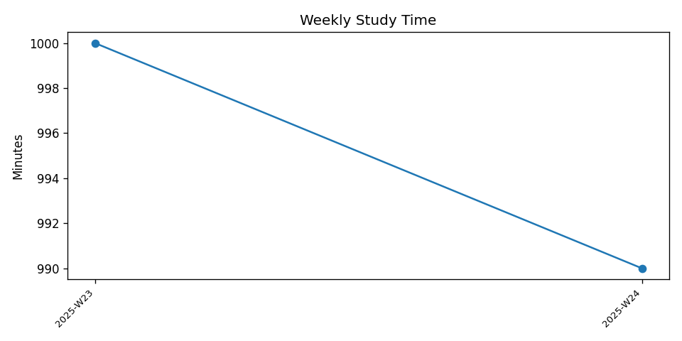
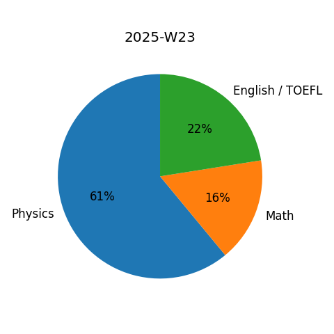

<h1 align="center">📚 study-log</h1>

<p align="center">
  
  
  
</p>

<p align="center">
Personal learning repository for 白石 拓海 (Takumi Shiraishi), <br>
tracking daily progress for university entrance prep and professional certifications.<br>
</p>

> **Mission:** Build a transparent, data‑driven study habit that combines physics, math, English (TOEFL), and IT Passport preparation.

---

## 🌟 What’s inside

```
study-log/
├── logs/                        # Study records
│   ├── daily/                   # Daily Markdown logs: YYYY-MM-DD.md
│   │   ├── 2025-06-09.md
│   │   └── …
│   └── weekly/                  # Weekly reviews: YYYY-WNN-review.md
│       ├── 2025-W23-review.md
│       └── …
├── physics/                     # C++ / Python simulations & notes
│   └── …
├── math/                        # Practice scripts, notebooks
│   └── …
├── it-passport/                 # Wrong-answer sheets, summaries
│   └── wrong/      
│       ├── 2023A-042.md
│       └── …
├── assets/                      # Images for README / notes
│   └── …
├── .github/
│   ├── ISSUE_TEMPLATE/          # Daily-log & week-review issue forms
│   │   ├── daily-log.md
│   │   └── week-review.md
│   ├── PULL_REQUEST_TEMPLATE.md # PR checklist
│   └── workflows/               # GitHub Actions (stats badge, CI, etc.)
│       └── stats.yml
├── tools/
│   ├── stats.py
│   └── itp_stats.py
├── CODE_OF_CONDUCT.md
├── CONTRIBUTING.md
├── SECURITY.md
├── LICENSE                       # MIT
├── README.md
├── .gitignore
└── requirements.txt              # Python deps for stats scripts

```

---

## 🚀 Daily Workflow

1. **Morning** – open a new Issue from the *Daily Study Log* template.
2. **Work sessions** – commit code or notes; use `closes #ISSUE_NUMBER` in the commit message.
3. **Evening** – push final commit and close the Issue; update energy & time metrics.
4. **Weekly** – open a *Week‑XX Review* Issue, close all daily Issues, and close the Milestone.

### Commit message convention

```
feat(physics): add projectile simulation (closes #34)
fix(math): correct trig solution (refs #56)
docs(log): 2025‑06‑09 study record (closes #78)
```

---

## 🗂️ Issue Templates & Milestones

| Template            | Purpose                  | Auto‑assigned milestone |
| ------------------- | ------------------------ | ----------------------- |
| **Daily Study Log** | Plans & logs for one day | Current Week            |
| **Week‑XX Review**  | Weekly reflection & KPIs | Current Week            |

Milestones are named `Week‑NN (YYYY‑MM‑DD ▶ YY‑MM‑DD)` and provide a burn‑down chart via GitHub Insights.

---

## 📈 Study Metrics

This repository uses:

* **GitHub Insights** – closed Issues vs. open.
* **WakaTime badge** – coding time (automatic via GitHub Actions).
* **Custom Python script** – converts `logs/` to a CSV and generates graphs (run `python tools/stats.py`).

---

## 🛠️ Development Environment

* **GitHub Codespaces** – pre‑configured `.devcontainer.json` with `g++`, `python3`, `clang-format`.
* **Local** – clone and install deps:

```bash
git clone https://github.com/WhiteStoneTak/study-log.git
cd study-log
# optional: python -m venv .venv && source .venv/bin/activate
pip install -r requirements.txt
```

---

## 🔖 License

All learning materials and notes are ©2025 Takumi Shiraishi. Code is MIT‑licensed unless specified.

---

## 🙌 Acknowledgements

* [AtCoder](https://atcoder.jp/) for problem sets.
* [Eigo‑Duke](https://www.eigo-duke.com/) for vocabulary drilling.
* [ITパスポート過去問道場](https://www.itpassportsiken.com/) for practice questions.

> “Small, daily improvements over time lead to stunning results.” – Robin Sharma

---

### 📊 Weekly Trend
<p align="center">
  
</p>

### 🥧 Latest Subject Mix
<p align="center">
  
</p>

### 🥧 IT-Passport Weak Point Chart
<p align="center">
  
</p>
